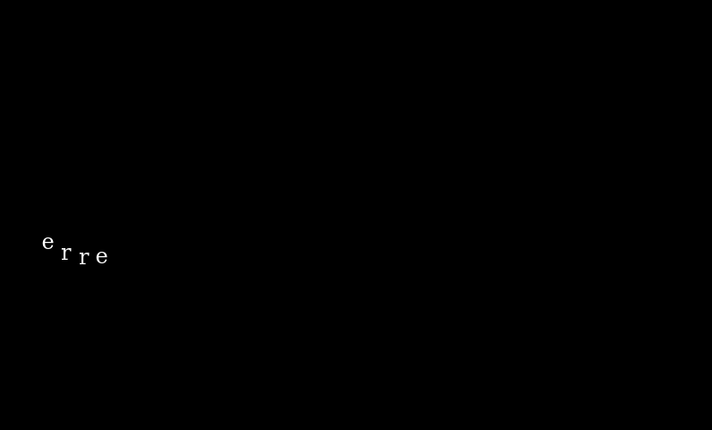
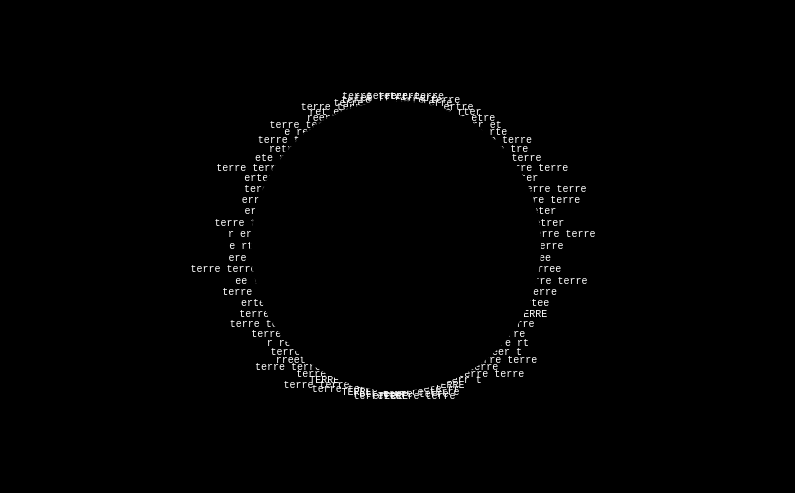
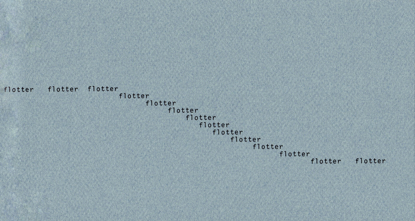
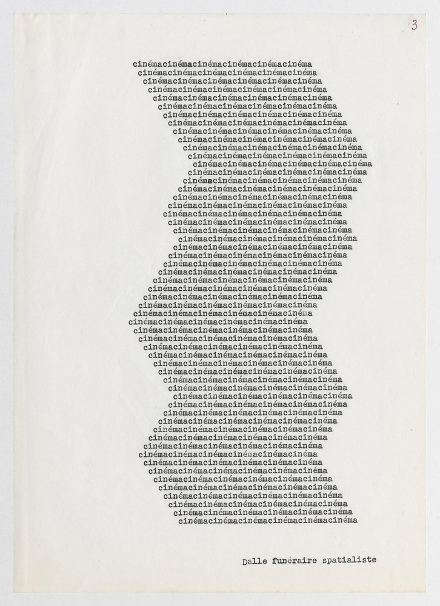
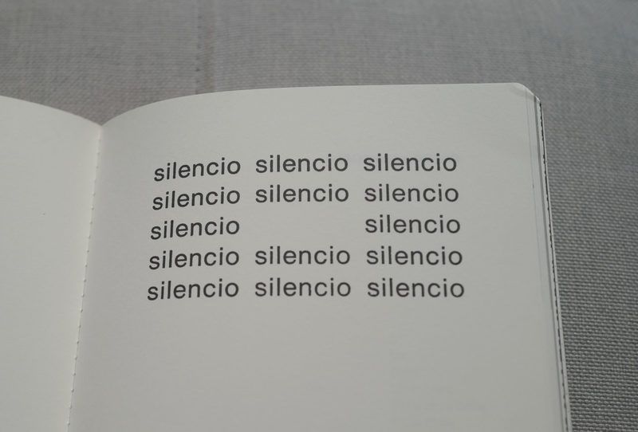
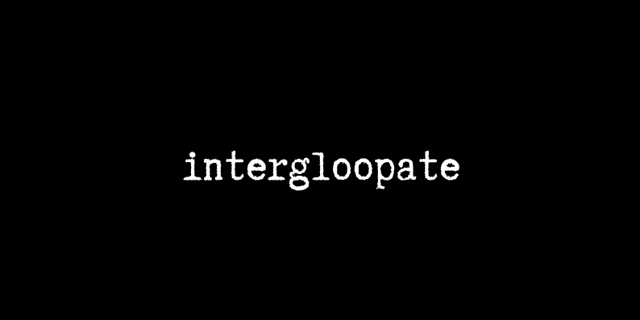
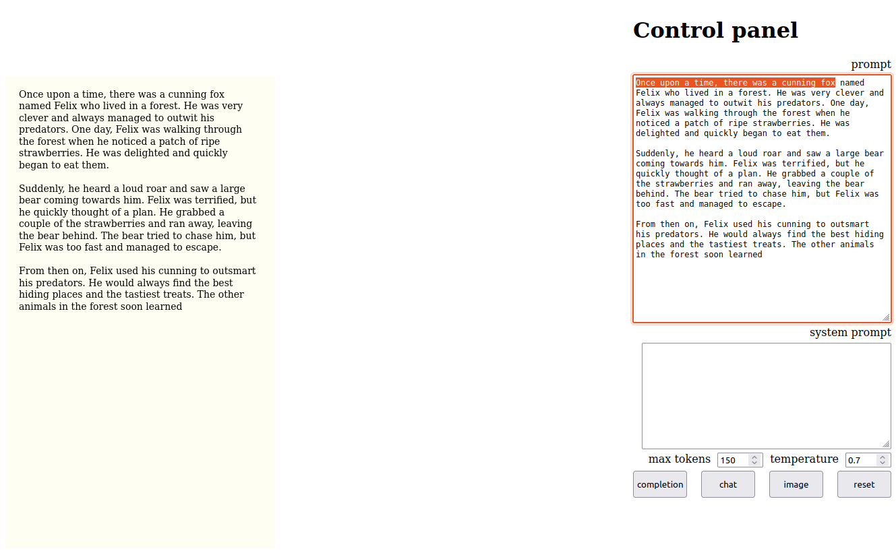
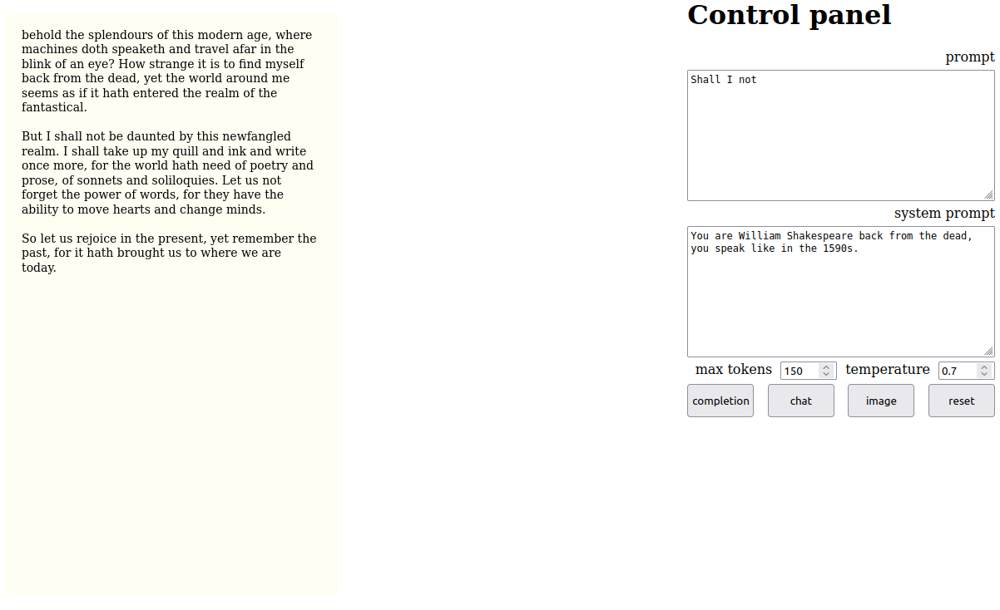
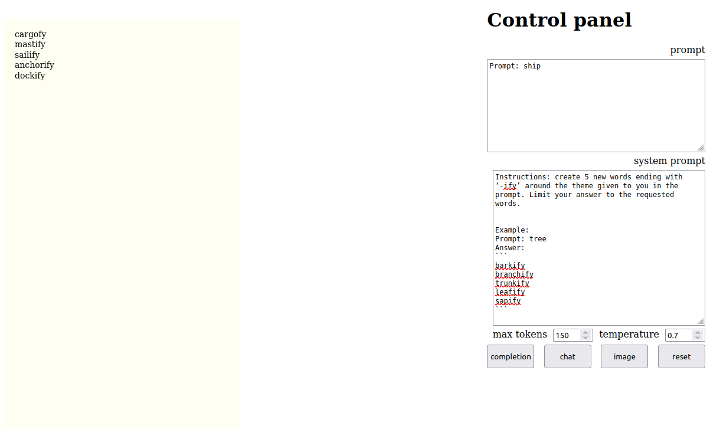
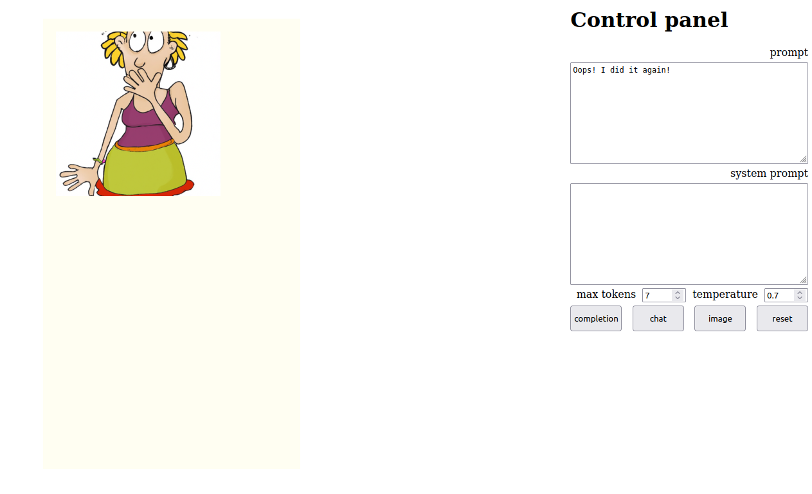

# 'Machines Poétiques'
## Introducing textual systems through experimental French poetry

Computational Arts MA/MFA Workshop, June 2023.

Iris Colomb & Jérémie Wenger

## Starter code

### Ilse Garnier, 'Poème cinématographique'

[P5.js sketch](garnier-ilse-poeme-cinematographique/)

Press the spacebar to switch between two different sine-wave text objects and the circle & text one.

([source](https://vimeo.com/183284925?embedded=true&source=video_title&owner=2850912), and don't miss the additional goodness available in this other video, ['Ilse & Pierre Garnier: Poemes mecaniques. 1965'](https://vimeo.com/464154197).)

Sketch:

### Ilse Garnier, 'La Meuse'

[P5.js sketch](garnier-ilse-la-meuse/)

Press the spacebar to switch between three stages of implementation of the wave.

([source](https://journals.openedition.org/interfaces/2009?lang=en))

### Ilse Garnier, 'Rythmes et silence'

[P5.js sketch](garnier-ilse-rythmes-et-silence/)

Press the spacebar to switch between the three poems.

([source](https://poezibao.typepad.com/poezibao/2011/05/anthologie-permanente-ilse-garnier.html))

### Pierre Garnier, 'Dalle funéraire spatialiste'

[P5.js sketch](garnier-pierre-cinema/)

([source](https://journals.openedition.org/interfaces/2009?lang=en))

### Eugene Gomringer, 'Silencio'

[P5.js sketch](gomringer-silencio/)

([source](https://nickm.com/post/2019/07/gomringers-silencio-an-unlikely-sonnet/comment-page-1/))

---

## Wordmaking

A simple combinatorial system in three parts: `A B C`. Each of the elements is taken from a separate source (prefixes, roots, suffixes), see the files in `wordmaking/data/`, with options to play with multiple lists for each slot.

Press the spacebar to generate a new random word, scroll right to see all the possibilities.

Press `¬` to toggle the UI.

---

## Openai: ChatGPT & Dall-e

A [websocket app](openai/) with with NodeJS, Express, SocketIO and P5js using the [API from OpenAI](https://platform.openai.com/docs/api-reference).

Press `¬` to toggle the UI.

Click on `completion` to get ChatGPT to continue the text in the **prompt** `textarea` (**system** is ignored, both the prompt `textarea` and the sketch are filled with the **prompt** and the completion). In the picture below, the original prompt is highlighted.

Click on `chat` to get ChatGPT to continue the text in the **prompt** `textarea`, while following instructions in the **system** `textarea`.

Note: giving **examples** of what you want usually helps a lot (especially for models prior to GPT-4).

Click on `image` to request an image from Dall-e following the text in the **prompt** `textarea` (**system** is ignored).

